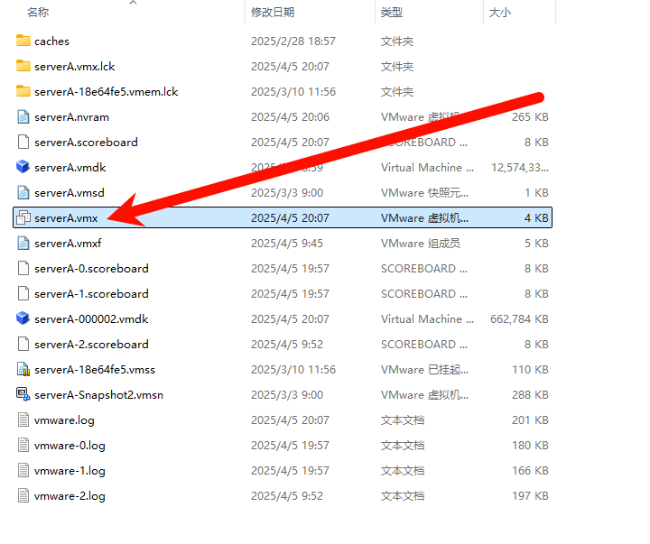

# 解决VMware启动时进入boot manager界面的解决方法

::: tip 问题详情

:::

> 

# 解决方案

在使用VMware创建虚拟机时，有时会遇到启动时直接进入Boot Manager界面的情况。这通常是由于固件类型设置不当引起的。以下是几种解决方法：

### 方法一：修改虚拟机设置

1. **关闭虚拟机**：确保虚拟机处于关闭状态。
2. **进入虚拟机设置**：在VMware中选择虚拟机，点击“设置”。
3. **更改固件类型**：在“选项”标签下，找到“高级”设置，将固件类型从`UEFI`更改为`BIOS`。
4. **启动虚拟机**：保存设置并重新启动虚拟机。

### 方法二：修改配置文件

1. **找到配置文件**：在虚拟机设置中，找到选项里的工作目录，进入该目录，找到后缀为`.vmx`的文件。

   

2. **编辑配置文件**：用记事本打开后缀为`.vmx`文件，找到`firmware = "efi"`*这一行，将其删除或修改为*`firmware = "bios"`。

    

3. **保存并重启**：保存文件并重启虚拟机。如果前几次启动报错，重启虚拟机并选择重新加载配置即可。

